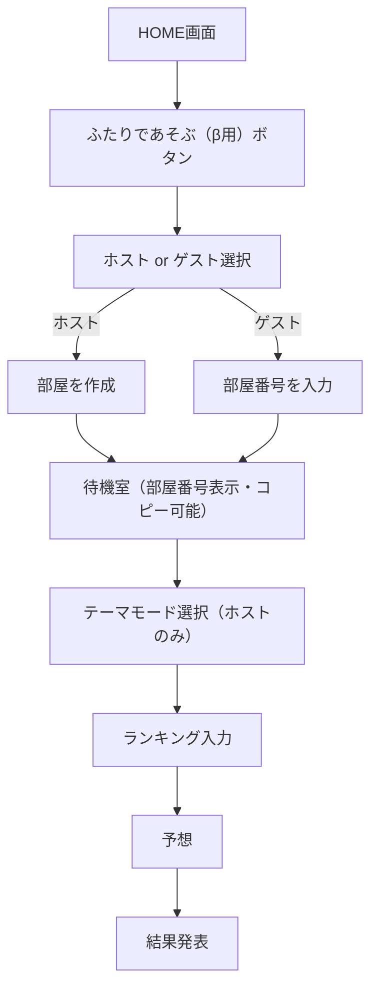
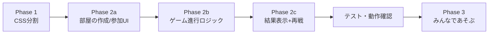

# RankQuest: リファクタリング + 部屋ベース新機能の開発計画

## Phase 1: CSS分割リファクタリング

### やること

- [index.html](c:\Users\rshio\Documents\liff-ranking-practice\index.html) の `<style>` タグ内（行28〜505、約478行）を `css/style.css` に抽出
- `<head>` に `<link rel="stylesheet" href="./css/style.css">` を追加
- `<style>...</style>` タグを削除

### 注意点

- **HTMLのインラインスタイル（`style="..."`）はそのまま残す**。今回は触らない
- CSSの中身は一切変更しない（移動のみ）
- GitHub Pagesでは相対パス `./css/style.css` で正常に読み込まれる

### リスク評価: 低

- ロジックに一切触れないため、機能的なバグは発生しない
- 唯一のリスクはパスの誤りによるスタイル未適用だが、デプロイ前に確認可能

---

## Phase 2: 部屋ベースのゲーム開始フロー（ふたりであそぶ β用）

### コンセプト

現在の「ペア設定 → ふたりであそぶ」フローとは独立に、新しい「部屋を立てる/参加する」フローを追加する。



### 既存コードとの関係

**絶対に触らないもの:**

- 既存の「ふたりであそぶ」ボタンと関連ロジック全体
- ペア設定関連の機能全体
- 既存の `gameSessions` Firebaseノード

**新規追加するもの:**

- HOME画面に「ふたりであそぶ（β用）」ボタン
- 新しいHTML画面（部屋選択・部屋作成・部屋参加）
- 新しいFirebaseノード `gameRooms`
- 新しいJS関数群（既存関数とは完全に分離）

### 新しいFirebaseデータ構造

```
gameRooms/
  "45821"/                    <-- 4-5桁の部屋番号がキー
    roomId: "45821"
    hostId: "LINE_USER_ID_1"
    hostName: "たろう"
    maxPlayers: 2             <-- ふたり用。将来 N に拡張
    gameMode: "duo"           <-- "duo" | "multi"（将来）
    status: "waiting"         <-- waiting | inputting | guessing | finished
    theme: null               <-- ゲーム開始時に設定
    themeMode: null            <-- "random" | "custom"
    players/
      "LINE_USER_ID_1"/
        displayName: "たろう"
        status: "waiting"
      "LINE_USER_ID_2"/
        displayName: "はなこ"
        status: "waiting"
    rankings/
      "LINE_USER_ID_1": { "1": "...", "2": "...", ... }
    guesses/
      "LINE_USER_ID_1": { "1": "...", "2": "...", ... }
    results/
      ...
    createdAt: "..."
    lastActivityAt: ...
```

### 部屋番号の生成ルール

- 4〜5桁のランダムな数字（例: `45821`）
- Firebase上で重複チェック
- 一定時間（例: 30分）経過した部屋は自動削除対象

### 新規追加するHTML画面

1. **部屋選択画面** (`betaRoleSelectScreen`)

   - 「部屋を作る（ホスト）」ボタン
   - 「部屋に入る（ゲスト）」ボタン
   - HOMEボタン

2. **部屋作成完了/待機画面** (`betaWaitingRoomScreen`)

   - 部屋番号を大きく表示
   - 「番号をコピー」ボタン
   - ゲスト参加状況の表示
   - HOMEボタン

3. **部屋参加画面** (`betaJoinRoomScreen`)

   - 部屋番号入力欄（数字4-5桁）
   - 「参加する」ボタン
   - HOMEボタン

### ゲーム進行部分の方針

テーマ選択・ランキング入力・予想・結果表示のロジックは、既存の関数群を**参考にしつつ新しい関数として実装**する。理由:

- 既存コードに影響を与えない
- 将来の「みんなであそぶ」拡張時にN人対応しやすい
- `gameRooms` ノードを参照する新しいセッション管理が必要

ただし、CSS・HTML構造（テーマ選択画面の見た目、ランキング入力フォーム等）は既存のものを流用・コピーして効率化する。

---

## Phase 3: みんなであそぶモード（設計のみ）

Phase 2の部屋ベースシステムを自然に拡張する形で設計する。実装はPhase 2完了後に着手。

### ゲームロジック

- 全員がランキングを入力
- 全員が**他の全員のランキング**を予想（N人なら N-1人分）
- 結果画面で「誰が誰のランキングを最も正確に予想できたか」を表示

### 主な変更点（Phase 2からの差分）

- `maxPlayers` を 3〜8 に拡張
- 予想フェーズを N-1回繰り返すUI
- 結果画面をN人対応
- `gameMode: "multi"` で分岐

### マネタイズとの関係

- `gameMode` フィールドで `"duo"` と `"multi"` を明確に分離
- 将来的にmultiモードのみ課金ゲートを設ける設計
- Phase 2の時点で `gameMode` フィールドを含めておくことで、後から自然に拡張可能

---

## ペア設定システムについての推奨

**現時点では「残す」ことを推奨**する。理由:

1. 既存のα版テスターが使っている機能であり、削除するとテスターに影響
2. 部屋ベースの新フローが安定するまでは、既存フローが保険として機能
3. 将来的に「お気に入りパートナー」「フレンド登録」などに進化させる可能性がある

部屋ベースの新フローが十分にテストされ安定した段階で、以下のいずれかを判断:

- ペア設定を廃止し、部屋ベースに完全移行
- ペア設定を「フレンド機能」として残す（クイック招待など）

---

## 実装順序の全体像



- **Phase 1**: 1セッションで完了（低リスク）
- **Phase 2a**: 部屋の作成・参加・待機のUIとFirebase連携
- **Phase 2b**: テーマ選択 → ランキング入力 → 予想のゲーム進行
- **Phase 2c**: スコア計算・結果表示・もう一度遊ぶ
- **Phase 3**: Phase 2完了後に着手（大規模）

---

## 今回のセッションでの作業範囲

Phase 1（CSS分割）を完了させ、Phase 2aのHTML画面追加に着手するのが現実的な目標。